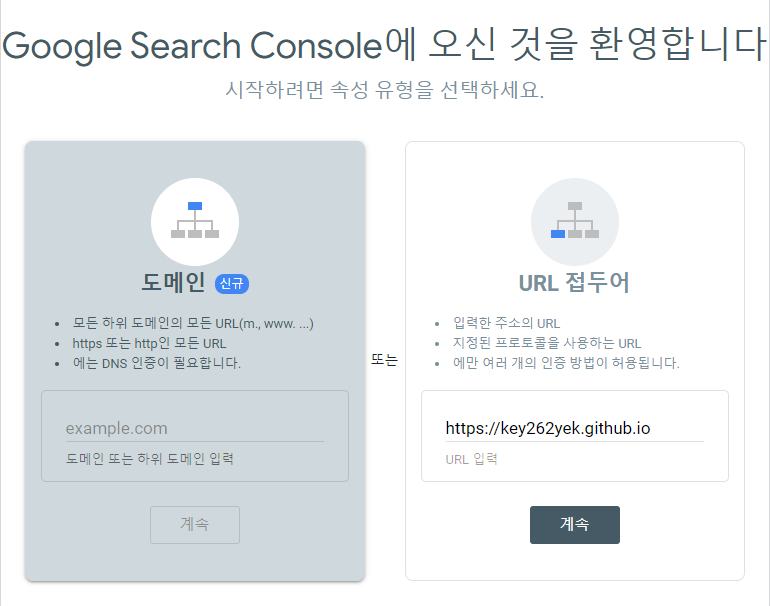
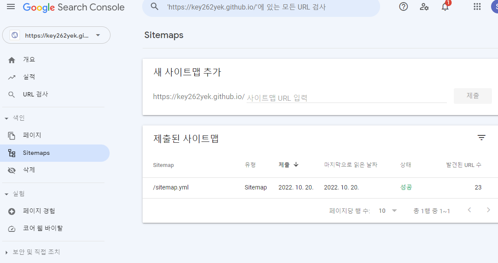

## Introduction
Github 블로그의 결과물은 가만히 둔다고 검색되지 않습니다. 
검색시 site 태그로 블로그 주소를 고정하면 아예 검색결과가 없다고 나오구요.
구글에서 검색되도록 하기 위해서는 [Google search console]("https://search.google.com/u/0/search-console/welcome?utm_source=wmx&utm_medium=deprecation-pane&utm_content=home")에 블로그를 등록해야만 합니다. 
이 글에서는 Github 블로그를 Search console에 등록하는 방법에 대해 기술합니다.

## Domain? URL?


Google search console에 접속하면 위와 같은 창이 뜹니다. 
우리는 DNS 회사에서 직접 도메인을 구매해 사용하는 것이 아니기 때문에, 오른쪽의 url 접두어 부분에 사이트 주소를 입력하고 계속 버튼을 누릅니다. 
그러면 다음과 같이 가능한 인증 방식을 여러 개 알려줍니다.

- HTML 파일 : 웹사이트에 HTML 파일 업로드 (권장)
- HTML 태그 : 사이트 홈페이지에 메타태그 추가
- Google 애널리틱스 : Google 애널리틱스 계정 사용
- Google 태그 관리자 : Google 태그 관리자 계정 사용
- 도메일 이름 공급업체 ; DNS 레코드와 Google 연결

## HTML File upload
먼저 HTML 파일을 이용하는 방법을 써봅시다. 
제공된 `google********.html`과 같은 이름의 파일을 `_config.yml`파일이 있는 디렉토리에 업로드합니다. 
그 후 조금 기다린 후 업로드된 html이 잘 작동하는지 확인하고, search console에서 확인하면 됩니다.
소유권이 제대로 확인되었다면 이제 속성으로 이동해 sitemap을 추가하면 됩니다.

### Sitemap.yml
이제 아래와 같은 파일을 만들어 블로그 root 디렉토리에 넣어줍니다. 

```
---
layout: null
---

<?xml version="1.0" encoding="UTF-8"?>
<urlset xmlns:xsi="http://www.w3.org/2001/XMLSchema-instance"
        xsi:schemaLocation="http://www.sitemaps.org/schemas/sitemap/0.9 http://www.sitemaps.org/schemas/sitemap/0.9/sitemap.xsd"
        xmlns="http://www.sitemaps.org/schemas/sitemap/0.9">
    
    <url>
        <loc>{{ site.url }}{{ post.url }}</loc>
        
        <lastmod>{{ post.date | date_to_xmlschema }}</lastmod>
        
        <lastmod>{{ post.lastmod | date_to_xmlschema }}</lastmod>
        

        
        <changefreq>weekly</changefreq>
        
        <changefreq>{{ post.sitemap.changefreq }}</changefreq>
        

        
        <priority>0.5</priority>
        
        <priority>{{ post.sitemap.priority }}</priority>
        

    </url>
    
</urlset>
```

### robots.txt
이제 구글 크롤러는 사이트를 체크할 수 있게 됩니다. 
그 과정에서 크롤러는 `robots.txt`를 통해 sitemap의 위치와 제한을 확인하게 됩니다. 
root 디렉토리에 아래와 같은 `robots.txt`를 추가해줍니다.

```
User-agent: *
Allow: /

Sitemap: https://key262yek.github.io/sitemap.yml
```

### register sitemap
이제 해당 sitemap 파일을 google search console에 등록해주면 됩니다. 


### 등록 결과 확인
바로 사이트 게시물을 검색할 수는 없습니다. 빠르면 일주일, 느리면 한 달까지도 걸리는 것 같은데 기다리고 나면 아래와 같이 검색이 가능합니다. 
